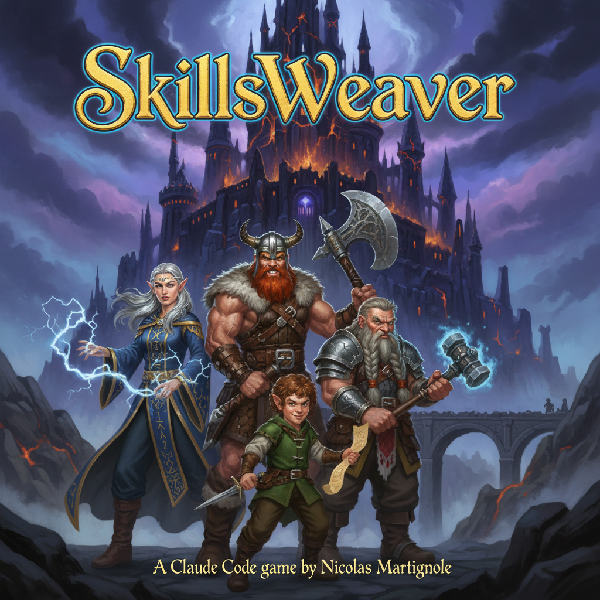

# SkillsWeaver



**SkillsWeaver** is an interactive tabletop RPG engine powered by [Claude Code](https://claude.ai/claude-code) created by Nicolas Martignole.
The engine is based on [Basic Fantasy RPG](https://www.basicfantasy.org/) rules. It combines AI orchestration with Go CLI tools to create a complete role-playing experience.


## See it live on YouTube

You can watch a sample game session on [my YouTube channel](https://youtu.be/K5CCB7MmegM) - English subtitles available

## What is this repository?

SkillsWeaver demonstrates how to build a complex, multi-tool AI application using Claude Code's skills and agents system. It includes:

- **Dice rolling** with standard RPG notation (2d6+3, 4d6kh3, advantage/disadvantage)
- **Character generation** following BFRPG rules (4 races, 4 classes)
- **Adventure management** with session tracking and automatic journaling
- **NPC generation** with personalities, motivations, and secrets
- **AI image generation** for characters, scenes, and monsters via fal.ai
- **Monster manual** with 33 classic fantasy creatures
- **Treasure generation** using official BFRPG tables
- **Journal illustration** - automatically generate images for adventure logs

## Prerequisites

### 1. Claude Code

Install [Claude Code](https://claude.ai/claude-code), Anthropic's official CLI for Claude. We recommend to use the native version.
A key is not required to play as the game can use the Haiku model. 

### 2. Go

Go 1.25 is required to build the CLI tools:

```bash
# macOS
brew install go

# Or download from https://go.dev/dl/
```

### 3. fal.ai API Key (for image generation) - OPTIONAL

Get your API key from [fal.ai](https://fal.ai) and set it:

```bash
export FAL_KEY="your_fal_ai_api_key"
```

### 4. Anthropic API Key (for journal enrichment) - OPTIONAL

The `sw-adventure enrich` command uses Claude API to automatically generate bilingual descriptions for journal entries. Get your API key from [Anthropic Console](https://console.anthropic.com/) and set it:

```bash
export ANTHROPIC_API_KEY="your_anthropic_api_key"
```

**Note:** Journal enrichment uses Claude Haiku 4.5 for cost-effective, high-quality descriptions (~$0.0003 per entry).

## Quick Start

### 1. Build all CLI tools

```bash
make build
```

Or manually:

```bash
go build -o sw-dice ./cmd/dice
go build -o sw-character ./cmd/character
go build -o sw-adventure ./cmd/adventure
go build -o sw-names ./cmd/names
go build -o sw-npc ./cmd/npc
go build -o sw-image ./cmd/image
go build -o sw-monster ./cmd/monster
go build -o sw-treasure ./cmd/treasure
```

### 2. Start Claude Code

```bash
claude
```

### 3. Try the skills

Once in Claude Code, the skills are automatically discovered. Try:

- *"Roll 4d6 keep highest 3"* → Uses dice-roller skill
- *"Create a dwarf fighter named Thorin"* → Uses character-generator skill
- *"Generate a portrait for Thorin"* → Uses image-generator skill
- *"Start a new adventure called The Lost Mine"* → Uses adventure-manager skill

## How It Works

```
┌─────────────────────────────────────────────────────────────┐
│                      Claude Code                             │
│  ┌─────────────┐  ┌─────────────┐  ┌─────────────┐          │
│  │ Skills      │  │ Agents      │  │ CLI Tools   │          │
│  │ (markdown)  │──│ (markdown)  │──│ (Go)        │          │
│  └─────────────┘  └─────────────┘  └─────────────┘          │
│        │                │                │                   │
│        ▼                ▼                ▼                   │
│  ┌─────────────────────────────────────────────────┐        │
│  │              Orchestration Layer                 │        │
│  │  - Skill discovery and invocation               │        │
│  │  - Agent delegation for complex tasks           │        │
│  │  - Tool execution (Bash, Read, Write...)        │        │
│  └─────────────────────────────────────────────────┘        │
└─────────────────────────────────────────────────────────────┘
         │                    │                    │
         ▼                    ▼                    ▼
   ┌──────────┐        ┌──────────┐        ┌──────────┐
   │ data/    │        │ fal.ai   │        │ Terminal │
   │ (JSON)   │        │ (images) │        │ (output) │
   └──────────┘        └──────────┘        └──────────┘
```

### Skills (`.claude/skills/`)

Markdown files that teach Claude how to use specific tools:
- `dice-roller` - Roll dice with RPG notation
- `character-generator` - Create BFRPG characters
- `adventure-manager` - Manage campaigns and sessions
- `image-generator` - Generate fantasy illustrations
- `journal-illustrator` - Illustrate adventure journals

### Agents (`.claude/agents/`)

Specialized sub-agents for complex tasks:
- `dungeon-master` - Run game sessions with narrative
- `character-creator` - Guide players through character creation
- `rules-keeper` - Answer rules questions

### CLI Tools (`cmd/`)

Go binaries that perform the actual work:
- `sw-dice` - Dice rolling engine
- `sw-character` - Character management
- `sw-adventure` - Adventure/campaign tracking
- `sw-image` - Image generation via fal.ai
- `sw-monster` - Monster stats and encounters
- `sw-treasure` - Treasure generation

## Example: Enriching Journal Entries with AI

The journal enrichment feature automatically generates detailed, bilingual descriptions for your adventure log using Claude AI. These descriptions are optimized for image generation and provide rich context.

```bash
# Preview entries that need enrichment (dry-run mode)
./sw-adventure enrich "my-adventure" --dry-run

# Enrich all entries without descriptions
./sw-adventure enrich "my-adventure"

# Enrich only recent entries
./sw-adventure enrich "my-adventure" --recent=10

# Enrich entries from a specific session
./sw-adventure enrich "my-adventure" --session=2

# Re-generate existing descriptions (force mode)
./sw-adventure enrich "my-adventure" --force

# Preview with filters
./sw-adventure enrich "my-adventure" --from=50 --to=100 --dry-run
```

The AI generates descriptions following these guidelines:
- **Length:** 30-50 words per description
- **Format:** [Characters] + [Location] + [Action] + [Atmosphere] + [Visual Details]
- **Languages:** English (for image generation) + French (for readability)
- **Context-aware:** Uses party composition, recent events, and session info

Example output:
```
Entry 88 [note]:
📝 EN: Aldric, Lyra, Thorin, and Gareth stand before Mother Isabelle in the
       candlelit halls of the Convent, their burden lifted as the abbess
       accepts stewardship of the pilgrimage to Twilight Mountain.

📝 FR: Aldric, Lyra, Thorin et Gareth se tiennent devant Mère Isabelle dans
       les salles du Couvent illuminées aux chandelles, soulagés de leur
       fardeau tandis que l'abbesse accepte la garde du pèlerinage.
```

## Example: Illustrating an Adventure Journal

After enriching your journal, automatically generate images for key moments:

```bash
# Preview what would be generated
./sw-image journal "my-adventure" --dry-run

# Generate images (parallel, fast)
./sw-image journal "my-adventure"

# Use a higher quality model
./sw-image journal "my-adventure" --model=banana

# Only combat scenes
./sw-image journal "my-adventure" --types=combat
```

Output:
```
data/adventures/my-adventure/images/
├── journal_002_exploration_schnell.png
├── journal_008_combat_schnell.png
├── journal_015_discovery_schnell.png
└── journal_029_session_schnell.png
```

## Available Models (fal.ai)

| Model | Speed | Cost/image | Use Case |
|-------|-------|------------|----------|
| `schnell` | ~3s | ~$0.003 | Fast iterations, drafts, testing |
| `banana` | ~5s | ~$0.039 | Better quality, final renders |

**Cost comparison for 20 images:**
- schnell: 20 × $0.003 = **$0.06**
- banana: 20 × $0.039 = **$0.78**

## Project Structure

```
skillsweaver/
├── .claude/
│   ├── skills/           # Claude Code skills
│   └── agents/           # Specialized sub-agents
├── cmd/                  # Go CLI source code
├── internal/             # Go packages
├── data/
│   ├── characters/       # Saved characters (JSON)
│   ├── adventures/       # Saved adventures (JSON)
│   └── images/           # Generated images
├── CLAUDE.md             # Project instructions for Claude
└── README.md             # This file
```

## License

**SkillsWeaver** is licensed under the [Creative Commons Attribution-ShareAlike 4.0 International (CC BY-SA 4.0)](http://creativecommons.org/licenses/by-sa/4.0/) license.

This means you are free to:
- **Share** — copy and redistribute the material
- **Adapt** — remix, transform, and build upon the material

As long as you:
- **Give attribution** to Nicolas MARTIGNOLE (the original author)
- **Share alike** — distribute your contributions under the same license

SkillsWeaver builds upon:
- **Basic Fantasy RPG** - © Chris Gonnerman and contributors (Open Game License)
- **Claude Code** - © Anthropic
- **fal.ai** - Image generation API

See the [LICENSE](LICENSE) file for full legal details.

## Author

This engine and the original idea is from **Nicolas MARTIGNOLE**, Principal Engineer at Back Market and Devoxx France's creator/organizer.

You can reach Nicolas by email: [nicolas.martignole@devoxx.fr](mailto:nicolas.martignole@devoxx.fr)


