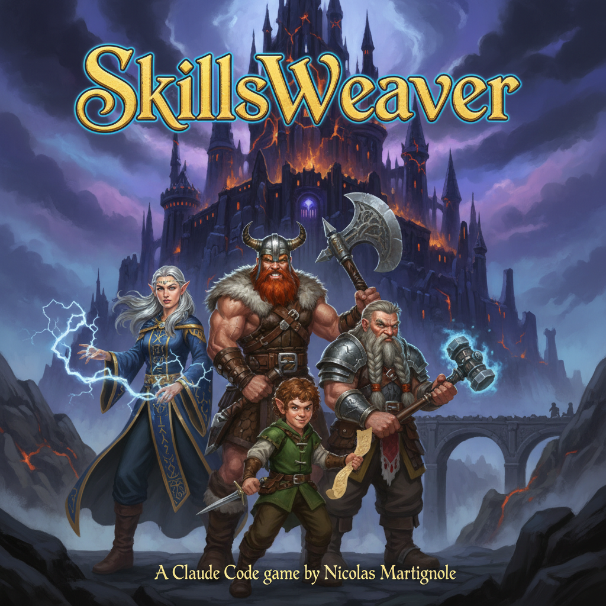

# SkillsWeaver



**SkillsWeaver** is an interactive tabletop RPG engine powered by [Claude Code](https://claude.ai/claude-code) created by Nicolas Martignole.
The engine is based on [Dungeon&Dragon v5.2 French version](https://media.dndbeyond.com/compendium-images/srd/5.2/FR_SRD_CC_v5.2.1.pdf) rules. It combines AI orchestration with Go CLI tools to create a complete role-playing experience.


## See it live on YouTube

You can watch a sample game session on [my YouTube channel](https://youtu.be/K5CCB7MmegM) - English subtitles available

## 🆕 Recent Updates

**June 2026:**
- 🔮 **Fortune-Teller Wizard** (`/adventure`) - A guided adventure creator where a seer has you draw tarot cards; each card secretly shapes the adventure (tone, antagonist, region, danger, pacing), grounded in the Four Kingdoms lore
- 🃏 **Tarot deck & scene art** - Card and UI visuals generated via fal.ai (`sw-image tarot-deck`, `sw-image voyante-assets`)
- 🧙 **Hero selector** - Pick a subset of your heroes for an adventure (not always the whole party)
- ✍️ **Auto-suggested adventure name** - An evocative, editable title proposed from your reading
- 🇫🇷 **French campaign-plan prompt** - Generation instructions and world geography reference fully in French for more coherent French output

**February 2026:**
- ✨ **Web Interface** (`sw-web`) - Create adventures and play in your browser
- 📋 **Automatic Campaign Plans** - Generate 3-act structures with themes
- 🎮 **Model Selector** - Switch between Haiku, Sonnet, Opus during gameplay
- 🗺️ **Tactical Maps** - Display combat maps inline in web interface
- 💎 **Auto-Treasure** - Automatic treasure generation after combat
- 📈 **Level-Up Tools** - `update_character_stat` and `long_rest` for character progression
- 🌍 **D&D 5e Only** - Complete transition from Basic Fantasy RPG to D&D 5e SRD

## How to Play

SkillsWeaver offers two ways to play:

### Option 1: Web Interface (Recommended for Beginners)

The web interface (`sw-web`) provides the easiest way to create adventures and play:

```bash
# Build the tools
make build

# Set your Anthropic API key
export ANTHROPIC_API_KEY="your_key"

# Optional: Set fal.ai key for image generation
export FAL_KEY="your_fal_key"

# Launch the web server
./sw-web

# Open your browser at http://localhost:8085
```

**Features:**
- 🌐 **Modern Web UI** with Dark Fantasy theme
- 🎮 **Create adventures** directly from the browser
- 🤖 **Automatic campaign plan generation** (3-act structure)
- 👥 **Character management** with party overview
- 💬 **Real-time streaming** responses via SSE
- 🗺️ **Tactical maps** displayed inline
- 📖 **Live journal** with session tracking
- 🎨 **AI-generated images** shown during gameplay
- 📱 **Model selector** - Switch between Haiku, Sonnet, Opus

### Option 2: Command-Line Interface (Advanced)

The CLI (`sw-dm`) provides a terminal-based REPL experience:

```bash
# Build the tools
make build

# Set your Anthropic API key
export ANTHROPIC_API_KEY="your_key"

# Launch the Dungeon Master
./sw-dm
```

**Features:**
- 🎭 **Streaming narrative** responses
- 🎲 **Automatic dice rolling** and rule application
- 📊 **Adventure state management** (party, inventory, journal)
- 🎨 **Optional AI image generation** during gameplay
- ⌨️ **Full readline support** with history

> **Note:** While Claude Code can also orchestrate gameplay using the agents and skills in this repository, `sw-web` and `sw-dm` provide more streamlined and immersive experiences for actual game sessions.

## How to Create a New Adventure and Characters

You have three options to create adventures and characters:

### Option 1: Web Interface (Easiest - Recommended)

The web interface makes adventure creation effortless:

```bash
# Start the web server
./sw-web

# Open http://localhost:8085 in your browser
```

**Creating an Adventure — two paths from the homepage:**

**🔮 "Consult the fortune teller" (guided wizard, recommended)** — opens `/adventure`:

1. A **seer** greets you, then asks **5 questions**; for each you **draw one of 3 tarot cards**.
2. Each card silently sets a hidden parameter of the adventure — **tone, antagonist, region, danger, pacing** — woven into the Four Kingdoms lore. *You are never told what each card means* (inspired by Ultima IV's gypsy).
3. **Pick which heroes** join (all selected by default; uncheck to play with just one or two).
4. The seer **suggests an adventure name** (editable), you can add an optional free-text "intuition", then **"Consult the destiny"**.
5. A unique **destiny card** is revealed, then you're taken into the game.

> Tip: append `?debug=1` to `/adventure` to walk the draw and inspect the full generated prompt **without creating anything** (useful for development).
>
> The card art and scene visuals live under `web/static/cards/` and `web/static/voyante/`. Regenerate them with `./sw-image tarot-deck` and `./sw-image voyante-assets` (needs `FAL_KEY` or `GEMINI_API_KEY`).

**⚡ "Quick create" (classic form):**

1. **Click "Quick create"** on the homepage
2. **Fill in the form:** Name, Description, Duration, Adventure type, optional Theme
3. **Click "Create"**

**What happens automatically (both paths):**

✅ **If a theme / reading is provided:**
   - Generates a complete **3-act campaign plan** (beginning, twists, final confrontation)
   - Creates **main antagonist** with motivations and arc
   - Defines **2-3 critical foreshadows** linked to acts
   - Plans **pacing** (estimated sessions, duration)
   - Sets **MacGuffins** and important locations

✅ **Copies the chosen heroes** from `data/characters/` to the adventure (the wizard lets you pick a subset; quick-create copies all)
✅ **Creates party.json** from those characters
✅ **Initializes** inventory, journal, and session tracking
✅ **Keeps the new adventure coherent** with recent active adventures, avoiding reuse of their NPC names and plots

**Starting a Game Session:**

1. Click **"Play"** on the adventure card
2. The **Dungeon Master** loads automatically with full context:
   - Campaign plan briefing (hidden from players)
   - Party composition
   - Current location and gold
   - Recent journal entries
3. **Start chatting** with the DM via the message box
4. **Real-time streaming** responses appear instantly
5. **Images, maps, and tactical scenes** display inline

**During Gameplay:**

- **Left Panel:** Party status (HP, AC, level), shared inventory, recent journal
- **Center:** Conversation with streaming DM responses
- **Model Selector:** Switch between Haiku (fast), Sonnet (balanced), Opus (best)
- **Images:** Generated images appear automatically in the chat
- **Tactical Maps:** Combat maps display when generated

### Option 2: Claude Code Interactive Creation

Let Claude Code guide you through the entire process step by step:

**Step 1: Ask Claude Code to create characters**

In Claude Code, simply say:

```
"I want to create a new adventure. Help me create characters first."
```

Claude Code will:
1. Launch the `character-creator` agent
2. Guide you through choosing species, class, and abilities
3. Generate stats using 4d6 keep highest 3 (or standard array)
4. Apply species modifiers automatically
5. Help you select skills, combat style, and background
6. Save the character automatically

**Example conversation:**

```
You: "I want to create a new adventure. I need characters first."

Claude: "Let me help you create characters. How many do you want to create?
         For a balanced party, I recommend 3-4 characters:
         - 1 Tank/Fighter
         - 1 Ranged/Rogue
         - 1 Support/Healer"

You: "Create a human male fighter, 39 years old, veteran soldier"

Claude: [Launches character-creator agent]
        "Excellent choice! Let's create Marcus Sanggo.
         Rolling stats with 4d6 keep highest 3...
         [Shows stats]
         For a Fighter, I suggest: STR 16, DEX 14, CON 15...
         [Guides through choices]"

[Process repeats for each character]
```

**Step 2: Create the adventure**

Once you have 2-4 characters, tell Claude Code:

```
"Now create an adventure called 'The Magic Sextant of Cordova'"
```

Claude Code will:
1. Create the adventure with `sw-adventure create`
2. Add all your characters to the party automatically
3. Initialize inventory, journal, and session tracking
4. Show you the adventure status

**Step 3: Start playing**

```bash
./sw-dm
# Select your adventure from the menu
# The game begins!
```

### Option 3: Manual CLI Creation (Advanced)

If you prefer direct control, use the CLI tools:

**Create characters:**

```bash
# Create a fighter
./sw-character create "Marcus Sanggo" \
  --species=human \
  --class=fighter \
  --str=16 --dex=14 --con=15 --int=11 --wis=13 --cha=12

# Create a rogue
./sw-character create "Lyra" \
  --species=elf \
  --class=rogue \
  --str=10 --dex=18 --con=14 --int=12 --wis=16 --cha=10

# Create a bard
./sw-character create "Caelian Aurelmoor" \
  --species=human \
  --class=bard \
  --str=9 --dex=14 --con=13 --int=12 --wis=11 --cha=15
```

**Create adventure and add characters:**

```bash
# Create the adventure
./sw-adventure create "my-adventure"

# Add characters to the party
./sw-adventure add-character "my-adventure" "Marcus Sanggo"
./sw-adventure add-character "my-adventure" "Lyra"
./sw-adventure add-character "my-adventure" "Caelian Aurelmoor"

# Verify setup
./sw-adventure status "my-adventure"
```

**Start playing:**

```bash
./sw-dm
# Select your adventure and play!
```

### Character Creation Tips

**Balanced Party Composition:**
- **Tank/DPS:** Fighter, Barbarian, Paladin (high STR/CON, heavy armor)
- **Ranged/Scout:** Rogue, Ranger (high DEX, stealth, ranged attacks)
- **Support/Healer:** Bard, Cleric (CHA/WIS, healing spells, buffs)
- **Caster:** Wizard, Sorcerer, Warlock (INT/CHA, powerful spells)

**Stat Priorities by Class:**
- **Fighter/Barbarian:** STR > CON > DEX
- **Rogue/Ranger:** DEX > WIS/INT > CON
- **Bard/Cleric:** CHA/WIS > CON > DEX
- **Wizard/Sorcerer:** INT/CHA > CON > DEX

**Using the World Context:**

The project includes a rich world with 4 kingdoms (`data/world/factions.json`):
- **Valdorine:** Maritime merchant kingdom (Cordova capital)
- **Karvath:** Military empire (honor, discipline)
- **Lumenciel:** Religious theocracy (conversion, influence)
- **Astrène:** Declining scholarly kingdom (culture, magic)

You can create characters tied to these kingdoms for richer roleplay!

### What Gets Created

After setup, your file structure will look like:

```
data/
├── characters/
│   ├── marcus-sanggo.json
│   ├── lyra.json
│   └── caelian-aurelmoor.json
└── adventures/
    └── my-adventure/
        ├── adventure.json       # Adventure metadata
        ├── party.json           # Your 3 characters
        ├── inventory.json       # Shared inventory
        ├── sessions.json        # Session history
        ├── journal-meta.json    # Journal metadata
        └── journal-session-0.json # Pre-session journal
```

## What is this repository?

SkillsWeaver demonstrates how to build a complex, multi-tool AI application using Claude Code's skills and agents system. It includes:

- **🌐 Web Interface** (`sw-web`) - Modern browser-based UI with automatic campaign planning
- **🤖 Autonomous Dungeon Master** (`sw-dm`) - CLI REPL with full agent loop and tool use
- **🎲 Dice rolling** with standard RPG notation (2d6+3, 4d6kh3, advantage/disadvantage)
- **👤 Character generation** following D&D 5e rules (9 species, 12 classes)
- **📖 Adventure management** with session tracking and automatic journaling
- **🎭 NPC generation** with personalities, motivations, and secrets
- **🎨 AI image generation** for characters, scenes, and monsters via fal.ai
- **👹 Monster manual** based on official D&D 5e SRD (300+ monsters)
- **💎 Treasure generation** following D&D 5e treasure tables
- **🗺️ Map generation** with tactical, city, region, and dungeon maps
- **⚔️ Equipment & Spells** catalogs with complete stats

## Prerequisites

### 1. Claude Code (optional)

You can install [Claude Code](https://claude.ai/claude-code), Anthropic's official CLI for Claude if you want to test skills or each Agents.
Else, use directly the go cli with a valid ANTHROPIC API key.

### 2. Go

Go 1.25 is required to build the CLI tools:

```bash
# macOS
brew install go

# Or download from https://go.dev/dl/
```

### 3. fal.ai API Key (for image generation) - OPTIONAL

**OPTIONAL for `sw-image` and `sw-dm` (image generation)**

Get your API key from [fal.ai](https://fal.ai) and set it:

```bash
export FAL_KEY="your_fal_ai_api_key"
```

The `sw-dm` Dungeon Master can generate images during gameplay if FAL_KEY is configured. The skill-based `sw-image` tool also uses it for character portraits and scene illustrations.

### 4. Anthropic API Key

**REQUIRED for `sw-dm` (Dungeon Master agent)**
**OPTIONAL for `sw-adventure enrich` (journal enrichment)**

The autonomous Dungeon Master (`sw-dm`) requires direct access to Claude API for the agent loop. The `sw-adventure enrich` command also uses it for bilingual journal descriptions.

Get your API key from [Anthropic Console](https://console.anthropic.com/) and set it:

```bash
export ANTHROPIC_API_KEY="your_anthropic_api_key"
```

**Usage:**
- `sw-dm`: Uses Claude Haiku 4.5 for fast, immersive game sessions (~$1/M input tokens, ~$5/M output tokens)
- `sw-adventure enrich`: Uses Claude Haiku 4.5 for cost-effective descriptions (~$0.0003 per entry)

## Quick Start

### 1. Build all CLI tools

```bash
make build
```

Or manually:

```bash
go build -o sw-web ./cmd/web              # Web interface
go build -o sw-dm ./cmd/dm                # CLI Dungeon Master
go build -o sw-dice ./cmd/dice
go build -o sw-character ./cmd/character
go build -o sw-adventure ./cmd/adventure
go build -o sw-names ./cmd/names
go build -o sw-npc ./cmd/npc
go build -o sw-image ./cmd/image
go build -o sw-monster ./cmd/monster
go build -o sw-treasure ./cmd/treasure
go build -o sw-equipment ./cmd/equipment  # Equipment browser
go build -o sw-spell ./cmd/spell          # Spell reference
```

### 2. Start Claude Code

```bash
claude
```

### 3. Try the skills

Once in Claude Code, the skills are automatically discovered. Try:

- *"Roll 4d6 keep highest 3"* → Uses dice-roller skill
- *"Create a dwarf fighter named Thorin"* → Uses character-generator skill
- *"Generate a portrait for Thorin"* → Uses image-generator skill
- *"Start a new adventure called The Lost Mine"* → Uses adventure-manager skill

## Web Interface (sw-web)

The `sw-web` binary provides a modern web interface for creating adventures and playing game sessions through your browser.

### Features

- **🌐 Web-Based UI**: No terminal required - play in your browser
- **🔮 Fortune-Teller Wizard**: Guided creation at `/adventure` — draw tarot cards that secretly shape the adventure, pick your heroes, get an auto-suggested name
- **🎮 Adventure Creation**: Create adventures with automatic campaign plan generation (guided wizard or quick form)
- **📋 Campaign Plans**: Automatic 3-act structure with antagonists, foreshadows, and pacing
- **👥 Party Management**: View party status (HP, AC, level) in real-time
- **💬 Streaming Chat**: Real-time DM responses via Server-Sent Events (SSE)
- **🎨 Inline Media**: Images, maps, and tactical scenes display directly in chat
- **📖 Live Journal**: See events logged as they happen
- **🔄 Model Selector**: Switch between Haiku (fast), Sonnet (balanced), Opus (best quality)
- **📱 Responsive**: Works on desktop and tablet devices

### Architecture

```
Browser (localhost:8085)
    ↓ HTTP/SSE
sw-web (Gin server)
    ↓ Manage sessions
SessionManager
    ↓ Per-adventure
Agent Loop (dungeon-master)
    ↓ Tool calls
Go Packages (dice, monster, treasure, etc.)
```

### Routes

| Method | Path | Description |
|--------|------|-------------|
| GET | `/` | Homepage with adventure list |
| GET | `/adventures` | Get adventures (HTMX) |
| POST | `/adventures` | Create new adventure (quick form) |
| GET | `/adventure` | Fortune-teller creation wizard (`?debug=1` to inspect without creating) |
| POST | `/adventure` | Create adventure from the card reading |
| POST | `/adventure/suggest-name` | Suggest an adventure name from the reading |
| GET | `/adventure/destiny/:slug` | Poll for the generated destiny card |
| GET | `/play/:slug` | Game interface |
| POST | `/play/:slug/message` | Send message to DM |
| GET | `/play/:slug/stream` | SSE endpoint for streaming |
| GET | `/play/:slug/characters` | Party status (HTMX) |
| GET | `/play/:slug/info` | Adventure info (HTMX) |
| GET | `/play/:slug/images/*` | Generated images |

### Session Management

- **One session per adventure** (single-player focused)
- **30-minute timeout** after last activity
- **Automatic cleanup** of expired sessions
- **State persistence** in adventure directory

### Usage

```bash
# Build
go build -o sw-web ./cmd/web

# Run (default port 8085)
./sw-web

# Custom port
./sw-web --port=3000

# Debug mode (verbose logging)
./sw-web --debug

# Open browser
open http://localhost:8085
```

### Prerequisites

```bash
export ANTHROPIC_API_KEY="your_key"  # Required
export FAL_KEY="your_fal_key"        # Optional (for images)
```

---

## Command-Line Dungeon Master (sw-dm)

The `sw-dm` binary is a standalone Go application that acts as an autonomous Dungeon Master using the Anthropic API directly. Unlike the Claude Code skills that require manual orchestration, `sw-dm` runs a complete **agent loop** with tool use in a terminal REPL.

### Features

- **Full Agent Loop**: User → Claude → Tool Use → Execution → Claude → Response
- **Streaming Responses**: Real-time text streaming for immersive narrative
- **Adventure Auto-Loading**: Automatically loads party, inventory, journal, and game state
- **Direct Go Package Calls**: Tools call internal Go packages directly (no subprocess execution)
- **Interactive REPL**: Command-line interface with conversation history
- **Context Management**: Smart truncation to stay under token limits

### Available Tools

The Dungeon Master has access to these tools during gameplay:

| Tool | Purpose |
|------|---------|
| `roll_dice` | Roll dice with RPG notation (d20, 2d6+3, 4d6kh3) |
| `get_monster` | Look up monster stats from the bestiary |
| `log_event` | Record events in the adventure journal |
| `add_gold` | Modify the party's gold |
| `get_inventory` | Check the shared inventory |
| `generate_treasure` | Generate treasure using D&D 5e tables |
| `generate_npc` | Create NPCs with personality and motivations |
| `generate_image` | Generate fantasy-style images from prompts (requires FAL_KEY) |

### Usage

```bash
# Launch the Dungeon Master
./sw-dm

# Select your adventure from the menu
# The DM loads the full context and starts the REPL

> We enter the dark corridor cautiously
[DM narrates and rolls dice automatically]

> I attack the goblin with my longsword
[DM rolls attack, damage, updates journal]

> exit
```

### Example Session

```
============================================================
  La Crypte des Ombres
============================================================

📍 Lieu: Niveau Inférieur - Grande Chambre Funéraire
💰 Or: 1593 po

👥 Groupe:
   - Aldric (human fighter, niveau 1)
   - Lyra (elf magic-user, niveau 1)
   - Thorin (dwarf cleric, niveau 1)
   - Gareth (human fighter, niveau 1)

📖 Dernière action: Une créature scellée par des chaînes de
    mithril respire au centre de la chambre...
============================================================

> Aldric s'approche prudemment de la créature

[🎲 roll_dice: Perception check]
Le Maître du Jeu lance les dés...

Aldric avance avec précaution. Les chaînes de mithril tintent
légèrement à chaque respiration de la créature. Son marteau
Frappe-Juste émet une faible lueur bleue, réagissant à une
présence magique puissante...

[✓ log_event: Aldric approaches the chained creature]
```

### Architecture

```
sw-dm
├── internal/agent/
│   ├── agent.go          # Main agent loop
│   ├── tools.go          # Tool registry
│   ├── context.go        # Conversation & adventure context
│   └── streaming.go      # Event processing
├── internal/dmtools/     # Tool implementations
└── cmd/dm/main.go        # REPL application
```

### Why Two Approaches?

**Claude Code Skills** (`.claude/skills/`):
- Best for: Collaborative development, learning, exploring
- User controls flow and decisions
- Claude Code provides IDE integration

**Autonomous DM** (`sw-dm`):
- Best for: Actual gameplay sessions
- DM controls flow and makes decisions autonomously
- Faster, more immersive experience
- Direct API access with streaming

## How It Works

```
┌─────────────────────────────────────────────────────────────┐
│                      Claude Code                             │
│  ┌─────────────┐  ┌─────────────┐  ┌─────────────┐          │
│  │ Skills      │  │ Agents      │  │ CLI Tools   │          │
│  │ (markdown)  │──│ (markdown)  │──│ (Go)        │          │
│  └─────────────┘  └─────────────┘  └─────────────┘          │
│        │                │                │                   │
│        ▼                ▼                ▼                   │
│  ┌─────────────────────────────────────────────────┐        │
│  │              Orchestration Layer                 │        │
│  │  - Skill discovery and invocation               │        │
│  │  - Agent delegation for complex tasks           │        │
│  │  - Tool execution (Bash, Read, Write...)        │        │
│  └─────────────────────────────────────────────────┘        │
└─────────────────────────────────────────────────────────────┘
         │                    │                    │
         ▼                    ▼                    ▼
   ┌──────────┐        ┌──────────┐        ┌──────────┐
   │ data/    │        │ fal.ai   │        │ Terminal │
   │ (JSON)   │        │ (images) │        │ (output) │
   └──────────┘        └──────────┘        └──────────┘
```

### Skills (`.claude/skills/`)

Markdown files that teach Claude how to use specific tools:
- `dice-roller` - Roll dice with RPG notation
- `character-generator` - Create D&D 5e characters
- `adventure-manager` - Manage campaigns and sessions
- `name-generator` - Generate fantasy names by species
- `npc-generator` - Create NPCs with personalities and secrets
- `image-generator` - Generate fantasy illustrations
- `journal-illustrator` - Illustrate adventure journals
- `monster-manual` - Monster stats and encounters
- `treasure-generator` - Generate treasure using D&D 5e tables
- `equipment-browser` - Browse weapons, armor, and gear
- `spell-reference` - Spell details by class and level

### Agents (`.claude/agents/`)

Specialized sub-agents for complex tasks:
- `dungeon-master` - Run game sessions with narrative
- `character-creator` - Guide players through character creation
- `rules-keeper` - Answer rules questions

### CLI Tools (`cmd/`)

Go binaries that perform the actual work:
- `sw-web` - **Web interface** for adventure creation and gameplay (port 8085)
- `sw-dm` - **Autonomous Dungeon Master** with full agent loop (CLI REPL)
- `sw-dice` - Dice rolling engine
- `sw-character` - Character management
- `sw-adventure` - Adventure/campaign tracking
- `sw-names` - Fantasy name generation
- `sw-npc` - NPC generation with personalities
- `sw-image` - Image generation via fal.ai
- `sw-monster` - Monster stats and encounters
- `sw-treasure` - Treasure generation
- `sw-equipment` - Equipment catalog (weapons, armor, gear)
- `sw-spell` - Spell reference (divine and arcane)

## Example: Enriching Journal Entries with AI

The journal enrichment feature automatically generates detailed, bilingual descriptions for your adventure log using Claude AI. These descriptions are optimized for image generation and provide rich context.

```bash
# Preview entries that need enrichment (dry-run mode)
./sw-adventure enrich "my-adventure" --dry-run

# Enrich all entries without descriptions
./sw-adventure enrich "my-adventure"

# Enrich only recent entries
./sw-adventure enrich "my-adventure" --recent=10

# Enrich entries from a specific session
./sw-adventure enrich "my-adventure" --session=2

# Re-generate existing descriptions (force mode)
./sw-adventure enrich "my-adventure" --force

# Preview with filters
./sw-adventure enrich "my-adventure" --from=50 --to=100 --dry-run
```

The AI generates descriptions following these guidelines:
- **Length:** 30-50 words per description
- **Format:** [Characters] + [Location] + [Action] + [Atmosphere] + [Visual Details]
- **Languages:** English (for image generation) + French (for readability)
- **Context-aware:** Uses party composition, recent events, and session info

Example output:
```
Entry 88 [note]:
📝 EN: Aldric, Lyra, Thorin, and Gareth stand before Mother Isabelle in the
       candlelit halls of the Convent, their burden lifted as the abbess
       accepts stewardship of the pilgrimage to Twilight Mountain.

📝 FR: Aldric, Lyra, Thorin et Gareth se tiennent devant Mère Isabelle dans
       les salles du Couvent illuminées aux chandelles, soulagés de leur
       fardeau tandis que l'abbesse accepte la garde du pèlerinage.
```

## Example: Illustrating an Adventure Journal

After enriching your journal, automatically generate images for key moments:

```bash
# Preview what would be generated
./sw-image journal "my-adventure" --dry-run

# Generate images (parallel, fast)
./sw-image journal "my-adventure"

# Use a higher quality model with a valid fal.ai key 
./sw-image journal "my-adventure" --model=banana

# Only combat scenes
./sw-image journal "my-adventure" --types=combat
```

Output:
```
data/adventures/my-adventure/images/
├── journal_002_exploration_schnell.png
├── journal_008_combat_schnell.png
├── journal_015_discovery_schnell.png
└── journal_029_session_schnell.png
```

## Example: Generating the Fortune-Teller Art

The `/adventure` wizard uses a static tarot deck and scene visuals. Generate them once (re-runs skip what already exists):

```bash
# Preview the prompts without generating
./sw-image tarot-deck --dry-run

# Generate the tarot deck into web/static/cards/ (use fal.ai explicitly)
./sw-image tarot-deck --provider=fal --model=flux-2-pro

# Generate the scene visuals (tent background, banner, seer portrait, velvet table)
./sw-image voyante-assets --provider=fal

# Force regeneration of everything
./sw-image tarot-deck --force
```

`--provider` accepts `auto` (GEMINI then FAL), `fal`, or `google`.

## Available Models (fal.ai)

| Model | Speed | Cost/image | Use Case |
|-------|-------|------------|----------|
| `schnell` | ~3s | ~$0.003 | Fast iterations, drafts, testing |
| `banana` | ~5s | ~$0.039 | Better quality, final renders |

**Cost comparison for 20 images:**
- schnell: 20 × $0.003 = **$0.06**
- banana: 20 × $0.039 = **$0.78**

## Project Structure

```
skillsweaver/
├── .claude/
│   ├── skills/              # Claude Code skills
│   └── agents/              # Specialized sub-agents
├── cmd/                     # Go CLI source code
│   ├── web/                 # sw-web (Web interface)
│   ├── dm/                  # sw-dm (CLI Dungeon Master)
│   ├── dice/                # sw-dice
│   ├── character/           # sw-character
│   ├── adventure/           # sw-adventure
│   ├── names/               # sw-names
│   ├── npc/                 # sw-npc
│   ├── image/               # sw-image
│   ├── monster/             # sw-monster
│   ├── treasure/            # sw-treasure
│   ├── equipment/           # sw-equipment
│   └── spell/               # sw-spell
├── internal/                # Go packages
│   ├── web/                 # Web server (Gin, SSE, sessions)
│   │   ├── server.go        # HTTP server config
│   │   ├── handlers.go      # Request handlers
│   │   ├── session.go       # Session management
│   │   └── web_output.go    # SSE output handler
│   ├── agent/               # Agent loop orchestration
│   │   ├── agent.go         # Main agent loop
│   │   ├── agent_manager.go # Nested agent invocation
│   │   ├── persona_loader.go # Dynamic persona loading
│   │   ├── tools.go         # Tool registry
│   │   ├── context.go       # Context management
│   │   └── streaming.go     # Event processing
│   ├── dmtools/             # Tool implementations for DM
│   │   ├── agent_invocation_tool.go # invoke_agent
│   │   ├── skill_invocation_tool.go # invoke_skill
│   │   └── ...
│   ├── dice/                # Dice rolling logic
│   ├── character/           # Character management
│   ├── adventure/           # Adventure management
│   ├── monster/             # Bestiary
│   ├── treasure/            # Treasure generation
│   ├── npc/                 # NPC generation
│   ├── names/               # Name generation
│   ├── image/               # Image generation
│   ├── equipment/           # Equipment catalog
│   └── spell/               # Spell reference
├── web/                     # Web assets
│   ├── templates/           # HTML templates
│   │   ├── index.html       # Homepage (adventure list)
│   │   ├── game.html        # Game interface
│   │   └── partials/        # Reusable components
│   └── static/              # CSS and JavaScript
│       ├── css/fantasy.css  # Dark Fantasy theme
│       └── js/app.js        # SSE client
├── data/
│   ├── characters/          # Saved characters (JSON)
│   ├── adventures/          # Saved adventures (JSON)
│   │   └── <adventure>/
│   │       ├── adventure.json      # Metadata
│   │       ├── campaign-plan.json  # 3-act structure
│   │       ├── party.json          # Party composition
│   │       ├── inventory.json      # Shared inventory
│   │       ├── agent-states.json   # Agent conversations
│   │       ├── sessions.json       # Session history
│   │       ├── journal-meta.json   # Journal metadata
│   │       ├── journal-session-*.json
│   │       └── images/
│   │           └── session-*/      # Images by session
│   ├── world/               # World data
│   │   ├── factions.json    # 4 kingdoms
│   │   ├── geography.json   # Regions and cities
│   │   └── npcs.json        # World NPCs (promoted)
│   ├── monsters.json        # Bestiary
│   ├── treasure.json        # Treasure tables
│   └── names.json           # Name dictionaries
├── CLAUDE.md                # Project instructions for Claude
└── README.md                # This file
```

## License

**SkillsWeaver** is licensed under the [Creative Commons Attribution-ShareAlike 4.0 International (CC BY-SA 4.0)](http://creativecommons.org/licenses/by-sa/4.0/) license.

This means you are free to:
- **Share** — copy and redistribute the material
- **Adapt** — remix, transform, and build upon the material

As long as you:
- **Give attribution** to Nicolas MARTIGNOLE (the original author)
- **Share alike** — distribute your contributions under the same license

SkillsWeaver builds upon:
- **Claude Code** - © Anthropic
- **fal.ai** - Image generation API

This work includes material taken from the Lazy GM's Resource Document by Michael E. Shea of SlyFlourish.com, available under a Creative Commons Attribution 4.0 International License.

This work includes material taken from the System Reference Document 5.1 ("SRD 5.1") by Wizards of the Coast LLC and available at https://dnd.wizards.com/resources/systems-reference-document. The SRD 5.1 is licensed under the Creative Commons Attribution 4.0 International License available at https://creativecommons.org/licenses/by/4.0/legalcode.

See the [LICENSE](LICENSE) file for full legal details.

## Author

This engine and the original idea is from **Nicolas MARTIGNOLE**, Principal Engineer at Back Market and Devoxx France's creator/organizer.

You can reach Nicolas by email: [nicolas.martignole@devoxx.fr](mailto:nicolas.martignole@devoxx.fr)

